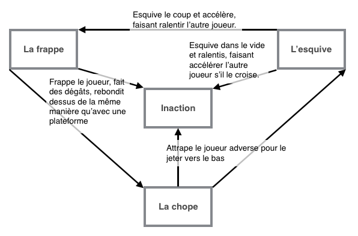

# Ressort

## Sommaire

#### Présentation du jeu
  - Le pitch : comment résumer le principe de jeu en s’abstrayant du gameplay
  - Le principe : le point de gameplay centrale
  - La navigation : presentation général du gameplay (interface, type de jeu, accent)
  - L’originalité : en quoi le gameplay est unique
  - Le public cible : quel type de joueur, en quoi le jeu est adapté à ce public

#### La technologie
  - La plateforme : quelle plateforme, pourquoi? Si multiplateforme comment gérer portage?
  - Le développement : quelle technologie, pourquoi?

#### Le scénario
  - L’histoire
  - Les personnages

#### Les mécanismes
  - La prise en main
  - Les déplacements
  - L’interface utilisateur
  - L’équilibrage
  - La navigation : arbre détaillant l’organisation des menus avec détail de ce que fait chaque élément

#### Les différentes arènes - détailler le level design et les particularités de chaque map

#### L’esthétique
  - La charte graphique
  - La charte sonore

#### La communauté - quelle relation avec la communauté? Quelle type de comm’? Des événements?

#### Le modèle économique - comment on gère le gain d'argent s'il y a?

___

#### Présentation du jeu

##### Le pitch - comment résumer le principe de jeu en s’abstrayant du gameplay

Le jeu consiste à un jeu de combat avec un gameplay dynamique jouant sur le timing et la stratégie, elle joue avec l’envie de prendre de la vitesse et de toujours plus augmenter le rythme de la partie.

##### Le principe - le point de gameplay centrale

Le gameplay du jeu se base sur trois points.
1. Tout d’abord, le **déplacement**. Le joueur est constamment en train de se déplacer en ligne droite. Il ne change de direction que lorsqu’il frappe un autre joueur ou une plateforme.Pour chaque coup bien timé, il accélère.
2. 
Ensuite, il a la **triangulation de coup** entre les joueurs, la frappe, l’esquive, et la chope (sans compter l’absence d’action). Pour faciliter la compréhension de la relation entre ces différentes verbes, voici un graphique:

    

3. Le troisième et dernier point essentiel est la **vitesse**. La vitesse est centrale au gameplay car elle donne beaucoup d’avantages.  
Tout d’abord au niveau du déplacement, plus on a de vitesse, plus on va vite, ce qui, du point de vue de l’adversaire, rend plus difficile à prévoir les mouvements adverses.  
De plus, comme le joueur ne peut changer de direction que lorsqu’il frappe un joueur où un obstacle, plus il va vite, plus il changera de direction rapidement. Cela confère plusieurs avantages, comme plus de réactivité au joueur, ou de la maitrise sur sa position, mais rajoutera de la difficulté car il devra être encore plus réactif pour éviter de se prendre un mur sans le frapper.  
Enfin, la vitesse fait varier d'autre statistiques de l'avatar. Il y a la portée d'attaque, plus le joueur va vite, plus il a de la portée ; des dégâts d'attaque, plus le joueur va vite, plus ses attaques feront de dégâts ; son angle de frappe possible, par contre, sera lui réduit avec la vitesse.

###### La navigation - présentation général du gameplay (interface, type de jeu, accent)
###### L’originalité - en quoi le gameplay est unique
###### Le public cible - quel type de joueur, en quoi le jeu est adapté à ce public
