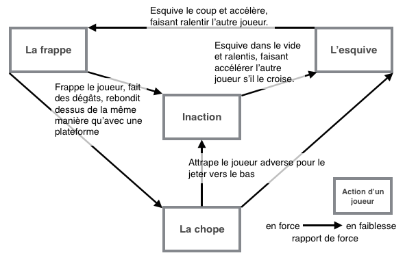
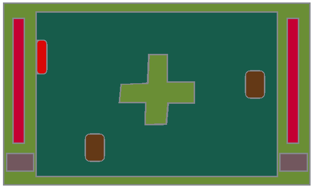

# Ressort

## Sommaire

#### Présentation du jeu
  - Le pitch : comment résumer le principe de jeu en s’abstrayant du gameplay
  - Le principe : le point de gameplay centrale
  - La navigation : presentation général du gameplay (interface, type de jeu, accent)
  - L’originalité : en quoi le gameplay est unique
  - Le public cible : quel type de joueur, en quoi le jeu est adapté à ce public
___

### Présentation du jeu

#### Le pitch - comment résumer le principe de jeu en s’abstrayant du gameplay

Le jeu consiste à un jeu de combat avec un gameplay dynamique jouant sur le timing et la stratégie, elle joue avec l’envie de prendre de la vitesse et de toujours plus augmenter le rythme de la partie.

#### Le principe - le point de gameplay centrale

Le gameplay du jeu se base sur trois points.
1. Tout d’abord, le **déplacement**. Le joueur est constamment en train de se déplacer en ligne droite. Il ne change de direction que lorsqu’il frappe un autre joueur ou une plateforme.Pour chaque coup bien timé, il accélère.
2. 
Ensuite, il a la **triangulation de coup** entre les joueurs, la frappe, l’esquive, et la chope (sans compter l’absence d’action). Pour faciliter la compréhension de la relation entre ces différentes verbes, voici un graphique:

    

3. Le troisième et dernier point essentiel est la **vitesse**. La vitesse est centrale au gameplay car elle donne beaucoup d’avantages.  
Tout d’abord au niveau du déplacement, plus on a de vitesse, plus on va vite, ce qui, du point de vue de l’adversaire, rend plus difficile à prévoir les mouvements adverses.  
De plus, comme le joueur ne peut changer de direction que lorsqu’il frappe un joueur où un obstacle, plus il va vite, plus il changera de direction rapidement. Cela confère plusieurs avantages, comme plus de réactivité au joueur, ou de la maitrise sur sa position, mais rajoutera de la difficulté car il devra être encore plus réactif pour éviter de se prendre un mur sans le frapper.  
Enfin, la vitesse fait varier d'autre statistiques de l'avatar. Il y a la portée d'attaque, plus le joueur va vite, plus il a de la portée ; des dégâts d'attaque, plus le joueur va vite, plus ses attaques feront de dégâts ; son angle de frappe possible, par contre, sera lui réduit avec la vitesse.

#### La navigation - présentation général du gameplay (interface, type de jeu, accent)

Ressort est un jeu de combat plateforme qui met l'accent sur la capacité à suivre le rythme en matière d'execution et de prendre de bonnes décisions stratégiques face à son adversaire. En matière d'interface, les joueurs partagent un écran commun d'une arêne visible entièrement, pour un point de vue de profil, et en . L'importance en taille des personnages varieront donc en fonction de la taille de l'arêne.
Une vue approximative de ce quoi rendrait l'interface:

#### L’originalité - en quoi le gameplay est unique

Le jeu propose une méthode particulière de se déplacer avec son système de rebond qui tranche avec les autres jeux plateforme combat existants. Sa gestion de la vitesse et son influence dans la partie en fait un élément unique dans le gameplay de Ressort en tant que jeu de combat.

#### Le publique cible - quel type de joueur, en quoi le jeu est adapté à ce publique

Le publique cible serait essentiellement des joueurs experimentés en matière d'execution pour profiter pleinement du potientiel de jeu, avec notamment le système de vitesse croissante. De plus le jeu pose quelques barrières pour sa prise en main pour les joueurs débutants. En effet, le système de rebond peut être punitif s'il est mal executé et pourrait frustrer le joueur lors de sa prise en main. Enfin, le joueur a accès à beaucoup de verbes d'actions qu'il doit comprendre et maitriser, ce qui pose un autre soucis en matière de prise en main.
